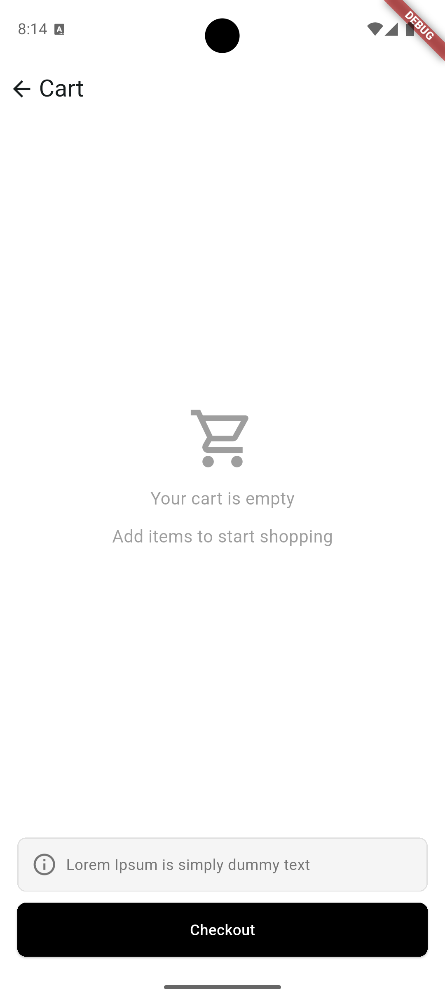
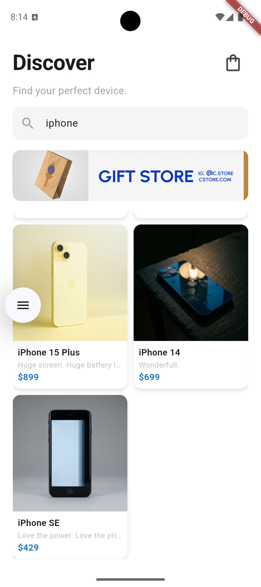
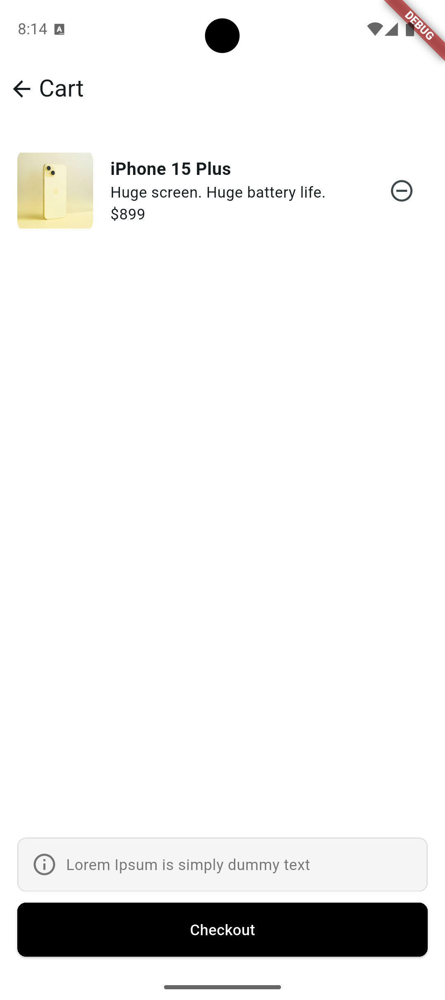
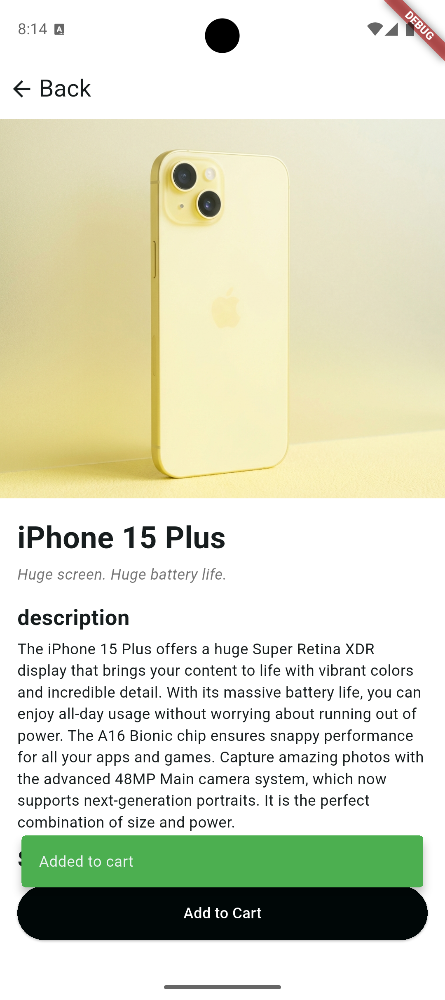

# Mini Katalog

Açıklama:  
Bu proje Flutter kullanılarak geliştirilmiş bir ürün katalog ve alışveriş uygulamasıdır.  
Kullanıcı ürünleri görebilir, sepete ekleyebilir ve checkout yapabilir.

## Flutter Sürümü

Flutter 3.x

### Çalıştırma Adımları

```bash
git clone https://github.com/bbelinaayy/mini-katalog.git
cd mini-katalog
flutter pub get
flutter devices
flutter run
```

#### Ekran Görüntüleri

Ana Ekran:  


Bos Sepet:  


Arama Sonuclari:  


Sepete Ekleme:  


Urun Detayi:  
